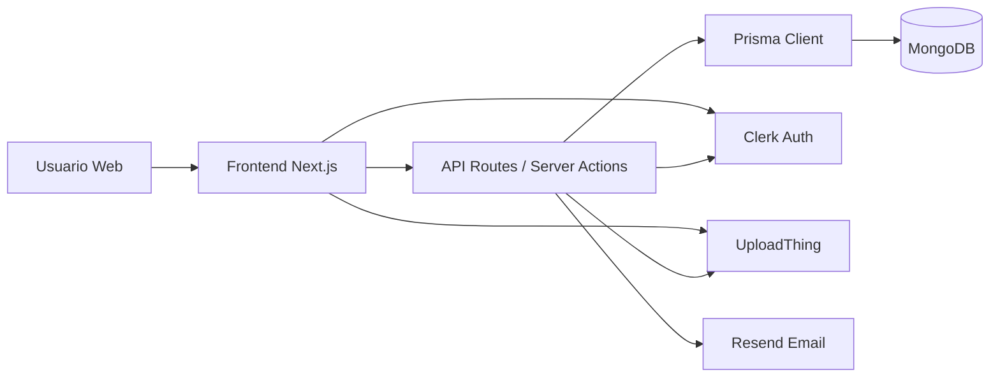

# Arquitectura del Sistema

## 1. Propósito

Describir cómo interactúan el frontend, backend, base de datos y servicios externos del LMS STEAM.

## 2. Vista general de componentes

- `Frontend`: Next.js (App Router) con React + TypeScript.
- `Backend`: API Routes de Next.js (Node.js runtime) y acciones del servidor.
- `Base de datos`: MongoDB mediante Prisma ORM.
- `Autenticación`: Clerk.
- `Archivos`: UploadThing.
- `Email transaccional`: Resend (recordatorios y notificaciones relacionadas con evaluaciones).

## 3. Diagrama de arquitectura lógica

## 4. Flujo principal de operación

1. El usuario se autentica con Clerk.
2. El frontend renderiza vistas y consume rutas API internas.
3. El backend valida permisos, procesa reglas de negocio y consulta/escribe en MongoDB vía Prisma.
4. Para cargas de archivos multimedia/documentos se integra UploadThing.
5. Para notificaciones por correo se usa Resend cuando la lógica de negocio lo requiere.

## 5. Organización del código

- `app/`: vistas, layouts y rutas API.
- `components/`: componentes de UI reutilizables.
- `actions/`: consultas agregadas para dashboard/cursos/analítica.
- `lib/`: utilidades, integración DB, evaluación y correo.
- `prisma/`: esquema y artefactos de datos.
