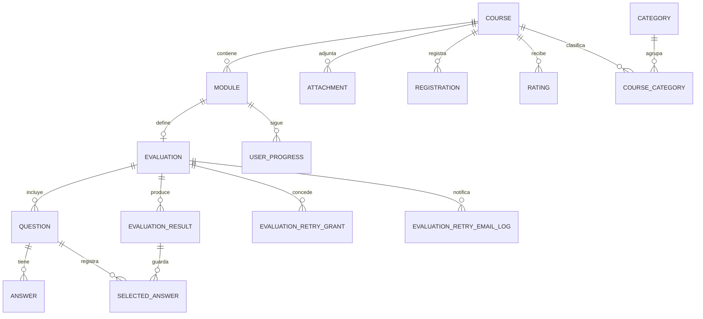

# Modelo de Datos

## 1. Tecnología y enfoque

La persistencia utiliza MongoDB con Prisma ORM (`provider = "mongodb"`).

## 2. Entidades principales

- `Course`: curso raíz con metadatos, publicación y relaciones.
- `Module`: unidades de contenido por curso.
- `Evaluation`, `Question`, `Answer`: evaluación por módulo y banco de preguntas.
- `EvaluationResult`, `SelectedAnswer`: resultados e intentos de usuarios.
- `Registration`: inscripción de usuario a curso.
- `UserProgress`: avance por módulo.
- `Certificate`: certificados de curso (relación desde `Course`).
- `Category`, `CourseCategory`: categorización por tabla puente.
- `Attachment`: archivos asociados al curso.
- `Rating`: calificaciones y comentarios.
- `RetryAccessCode`, `EvaluationRetryGrant`, `EvaluationRetryEmailLog`: control de reintentos en evaluaciones.

## 3. Diagrama entidad-relación (nivel lógico)

## 4. Relaciones y restricciones clave

- `Course` 1:N `Module`.
- `Module` 1:1 opcional `Evaluation` (por `moduleId` único en evaluación).
- `Evaluation` 1:N `Question`.
- `Question` 1:N `Answer`.
- `Course` N:M `Category` vía `CourseCategory` con restricción única `[courseId, categoryId]`.
- Índices para optimizar consultas frecuentes:
  - `Course`: `[isPublished, createdAt]`
  - `Module`: `[courseId, isPublished]`
  - `UserProgress`: `[userId, moduleId]`
  - `Registration`: `[userId, courseId]`

## 5. Notas para mantenimiento

- Prisma usa IDs `ObjectId` mapeados en `_id` para MongoDB.
- El `userId` se almacena como `String` referenciando la identidad de Clerk.
- Cualquier cambio de entidades debe sincronizarse con:
  - rutas API afectadas,
  - acciones del servidor,
  - validaciones del frontend.
